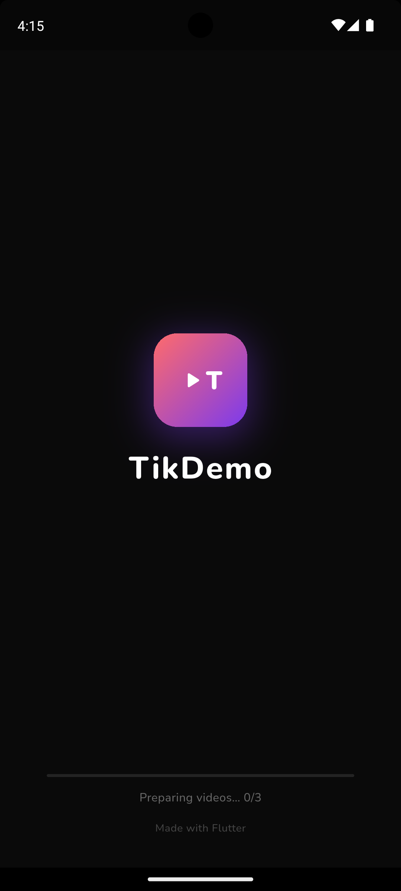
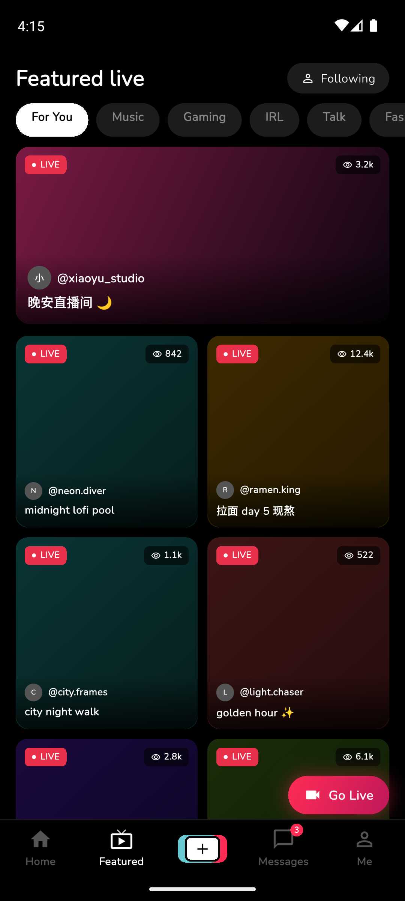
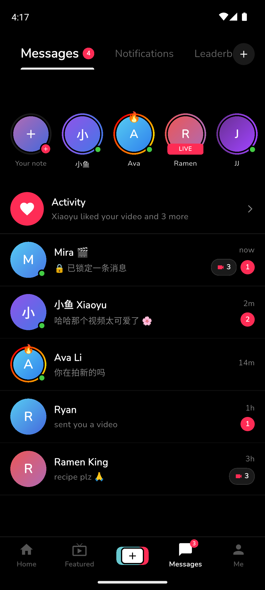
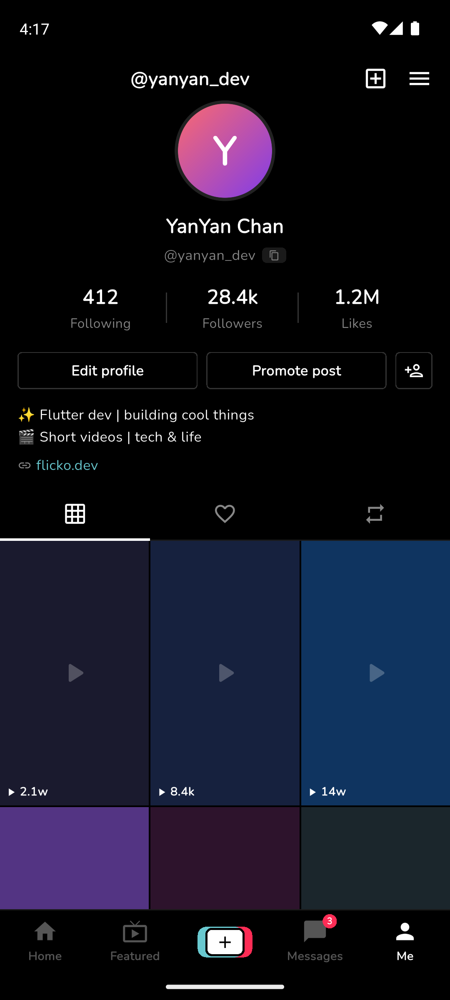

# Flicko Demo

A TikTok-style short video feed with real-time live streaming, built with Flutter and LiveKit.

---

## Table of Contents

- [Screenshots](#screenshots)
- [Installing Dependencies](#installing-dependencies)
- [Running the Project](#running-the-project)
- [Testing with a Host and a Viewer](#testing-with-a-host-and-a-viewer)
- [Replacing LiveKit Credentials](#replacing-livekit-credentials)
- [Handling Secrets Securely](#handling-secrets-securely)
- [Project Structure](#project-structure)
- [Video Preloading Strategy](#video-preloading-strategy)
- [LiveKit Integration](#livekit-integration)
- [Known Limitations](#known-limitations)

---

## Screenshots

<p float="left">
  
  
  
  
  
</p>

---

## Installing Dependencies

**Prerequisites**

| Tool | Version |
|------|---------|
| Flutter | ≥ 3.22.0 |
| Dart | ≥ 3.4.0 |
| Xcode | ≥ 15 (iOS builds) |
| Android Studio | ≥ Hedgehog (Android builds) |
| Real device | Required for the host role (camera + mic) |

**Steps**

```bash
# 1. Clone the repository
git clone https://github.com/<your-username>/flicko_demo.git
cd flicko_demo

# 2. Install Flutter packages
flutter pub get

# 3. Create your .env file from the template
cp .env.example .env
# then fill in your LiveKit credentials (see below)

# 4. Confirm no issues
flutter analyze
```

---

## Running the Project

List connected devices:

```bash
flutter devices
```

Run on iOS:

```bash
flutter run -d <ios-device-id>
```

Run on Android:

```bash
flutter run -d <android-device-id>
```

> **Note:** A real physical device is required for the host role. The iOS Simulator has no camera or microphone. The Android Emulator supports the viewer role only.

---

## Testing with a Host and a Viewer

You need two devices — or one real device (host) and one simulator (viewer-only).

### Host — Phone A

1. Open the app and tap the **Featured** tab.
2. Tap the red **Go Live** button in the bottom-right corner.
3. In the sheet, tap **Go Live**.
4. Enter a room name (used number for correct testing) (e.g. `123678`) and your display name (e.g. `host-alice`).
5. Tap **Start Streaming** and grant camera and microphone permissions.
6. You are now live.

### Viewer — Phone B or Simulator

1. Open the app and tap the **Featured** tab.
2. Tap the red **Go Live** button.
3. In the sheet, tap **Join as Viewer**.
4. Enter the **exact same room name** as the host (e.g. `123678`) and your display name (e.g. `viewer-bob`).
5. Tap **Join Stream**.
6. The host's video and audio will appear.

### Leaving the room

- **Host** — tap **End Live** or the ✕ button. The camera, microphone, Room, and all Tracks are released.
- **Viewer** — tap **Leave Stream** or the ✕ button.

---

## Replacing LiveKit Credentials

1. Sign up for a free account at [livekit.io](https://livekit.io).
2. Create a project in the LiveKit Cloud dashboard.
3. Copy your **WebSocket URL**, **API Key**, and **API Secret**.
4. Open your `.env` file and replace the placeholder values:

```
LIVEKIT_URL=wss://<your-project>.livekit.cloud
LIVEKIT_API_KEY=<your-api-key>
LIVEKIT_API_SECRET=<your-api-secret>
```

No code changes are needed. The app reads these values at startup via `flutter_dotenv`.

---

## Handling Secrets Securely

API keys and secrets are **never hardcoded** in the codebase.

**How it works:**

```
.env  (gitignored)
  └─▶  flutter_dotenv  (loaded in main.dart before runApp)
         └─▶  lib/config/env.dart  (Env.livekitUrl, Env.livekitApiKey, Env.livekitApiSecret)
                └─▶  lib/features/live/services/token_service.dart
```

- `.env` is listed in `.gitignore` and will never be committed.
- `.env.example` (empty values) is committed as a setup template for reviewers.
- If any required key is missing at runtime, `Env` throws a descriptive exception rather than silently using a null value.

> **Production note:** Token generation happens on-device in this demo using `dart_jsonwebtoken`. This is acceptable for a take-home demo but must **not** be used in production. In a real app, tokens must be issued by a backend server so the API secret is never shipped to the client.

---

## Project Structure

```
lib/
├── main.dart                          # Entry point: loads .env → ProviderScope → app
├── config/
│   └── env.dart                       # Typed .env accessors — throws if a key is missing
│
├── features/
│   ├── home/                          # Short video feed
│   │   ├── models/
│   │   │   └── video_item.dart        # Video data model
│   │   ├── providers/
│   │   │   ├── feed_provider.dart     # Paginated feed state
│   │   │   └── video_player_provider.dart  # ±2 sliding window of controllers
│   │   ├── services/
│   │   │   └── video_download_service.dart  # File-based download + cache
│   │   └── views/
│   │       ├── home_page.dart         # Vertical PageView
│   │       └── video_card.dart        # Full-screen card with overlays
│   │
│   ├── live/                          # LiveKit live streaming
│   │   ├── models/
│   │   │   ├── live_stream.dart       # Featured stream model
│   │   │   └── room_config.dart       # RoomConfig + RoomRole (host / viewer)
│   │   ├── providers/
│   │   │   ├── featured_provider.dart # Mock featured list
│   │   │   └── room_provider.dart     # Room lifecycle: connect → publish → disconnect
│   │   ├── services/
│   │   │   └── token_service.dart     # On-device JWT generator (demo only)
│   │   └── views/
│   │       ├── featured_page.dart     # Stream grid + Go Live FAB
│   │       ├── live_page.dart         # Room name + identity form
│   │       ├── host_view.dart         # Local camera preview + controls
│   │       └── viewer_view.dart       # Remote VideoTrackRenderer
│   │
│   ├── chat/                          # Messages UI
│   │   └── views/
│   │       └── messages_page.dart     # Stories row + activity + chat list
│   │
│   └── profile/                       # User profile UI
│       └── views/
│           └── profile_page.dart      # Avatar, stats, post grid
│
└── shared/
    ├── widgets/
    │   ├── bottom_nav.dart            # 5-tab navigation bar
    │   └── splash_screen.dart         # Splash + MainShell (IndexedStack routing)
    └── theme/
        └── app_theme.dart             # AppColors + AppTheme
```

---

## Video Preloading Strategy

Videos are downloaded to disk in full before playback begins — no network-URL streaming. This avoids bandwidth contention between the active video and background downloads.

On every page change, the app initialises the current slot first, then prepares the ±2 surrounding slots concurrently, and disposes anything further away. Background downloads for the next three upcoming videos are fired in parallel so files are ready before the user swipes to them.

The splash screen pre-downloads the three smallest videos so the feed opens with zero loading screens.

---

## LiveKit Integration

### Flow

```
FeaturedPage  ──▶  LivePage (room name + role form)
                       │
                       ▼
               RoomNotifier.connect()
                  ├─ TokenService.generate()  →  signed JWT
                  ├─ Room.connect(url, token)
                  ├─ Host: setCameraEnabled + setMicrophoneEnabled
                  └─ Viewer: listen for remote VideoTrack
                       │
              ┌────────┴────────┐
          HostView           ViewerView
      (local preview)    (VideoTrackRenderer)
```

### Resource cleanup

When a user leaves, `RoomNotifier.disconnect()` releases resources in this order:

```dart
room.removeListener(...)
await room.disconnect()   // graceful WebRTC disconnect; tracks unpublished automatically
room.dispose()            // releases all Track and internal Room state
```

`RoomNotifier.dispose()` calls the same path so resources are freed even if the provider is torn down by navigation.

---

## Known Limitations

| Area | Limitation |
|------|-----------|
| Token generation | On-device — must move server-side before any production use |
| Featured grid | Mock data, not a real API |
| Video feed | Fixed CDN list with paginated mock; no real backend |
| iOS Simulator | No camera or mic — host role requires a physical device |
| Orientation | Portrait-only; landscape is locked |
| Out of scope | Auth, gifts, danmaku, beauty filters, CDN publishing, payments |
